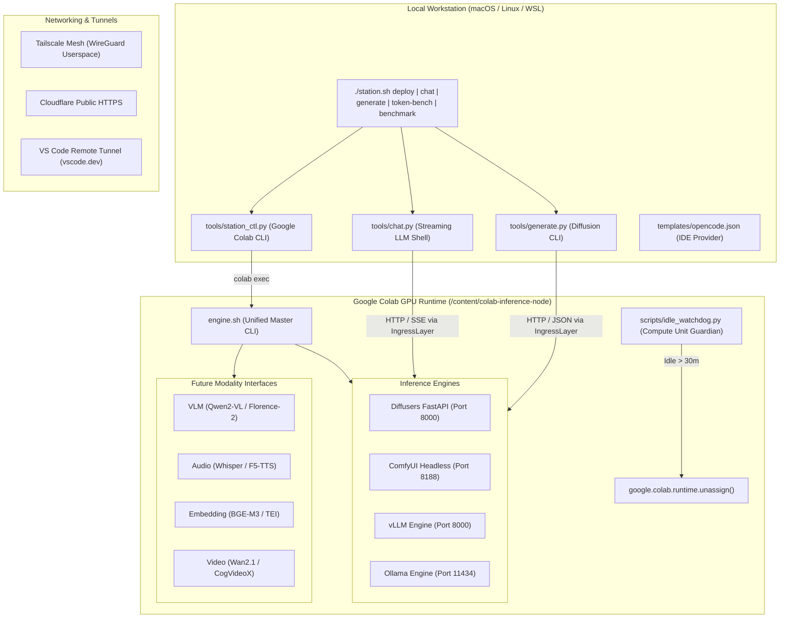

# Colab Model Station

An automated, reproducible remote inference and orchestration infrastructure for Google Colab GPU runtimes.

Serves arbitrary deep learning models across multiple modalities:
- **Diffusion & Vision**: **FLUX.1 (schnell/dev)**, **SDXL**, dynamic **LoRA** hot-swapping, and **ComfyUI**.
- **Large Language Models (LLM)**: **vLLM** (PagedAttention, AWQ, OpenAI-compatible) and **Ollama** (lightweight GGUF).
- **Extensible Modality Contracts**: First-class interfaces for **VLM** (Qwen2-VL), **Audio AI** (Faster-Whisper, F5-TTS), **Embeddings** (BGE-M3), and **Video** (Wan2.1).
- **Tri-Networking Ingress**: **Tailscale Userspace Mesh**, **Cloudflare Public Tunnels**, and **VS Code Remote Tunnels**.

---

## 1. System Architecture



---

## 2. Key Features

- **Multi-Engine Unification**: Run vLLM, Ollama, Diffusers, or ComfyUI headlessly through a single CLI controller [`engine.sh`](file:///content/colab-inference-node/engine.sh).
- **FLUX.1 & LoRA Hot-Swapping**: Native dynamic adapter loading, weight scaling, and unloading without reallocating base transformer pipelines.
- **Hardware-Aware Memory Optimization**: Automatic FP8 quantization and CPU offload strategy selection based on detected GPU VRAM (Tesla T4, NVIDIA L4, NVIDIA A100).
- **Accelerated Caching**: Native `hf_transfer` integration for high-speed weights prefetching; transparent Google Drive persistent caching when mounted.
- **Zero-Browser Headless CLI**: Automated remote provisioning, status checks, and teardown from local workstations using `google-colab-cli`.
- **VS Code Remote Tunnel**: Full desktop or web-based IDE connectivity (`https://vscode.dev/tunnel/<name>`) with credentials saved to Google Drive.
- **Compute Unit Protection**: Integrated background watchdog automatically terminates Colab instances when idle, preventing credit drain.

---

## 3. Hardware & Model Allocation Matrix

| GPU Hardware | VRAM | Engine | Target Model | Precision / Format | Offload Mode | Primary Workload |
| :--- | :--- | :--- | :--- | :--- | :--- | :--- |
| **NVIDIA T4** | 15 GB | **Ollama** | `qwen2.5-coder:7b` | GGUF Q4_K_M | Full VRAM | Lightweight code assistance |
| **NVIDIA T4** | 15 GB | **Diffusers** | `black-forest-labs/FLUX.1-schnell` | FP8 | Sequential Offload | 4-step diffusion generation |
| **NVIDIA T4** | 15 GB | **Diffusers** | `stabilityai/stable-diffusion-xl-base-1.0` | FP16 | Model Offload | SDXL latent diffusion |
| **NVIDIA L4** | 24 GB | **Ollama** | `qwen2.5-coder:32b` | GGUF Q4_K_M | Full VRAM | Advanced IDE coding |
| **NVIDIA L4** | 24 GB | **vLLM** | `Qwen/Qwen2.5-Coder-14B-Instruct-AWQ` | 4-bit AWQ | Full VRAM | High-throughput concurrent serving |
| **NVIDIA L4** | 24 GB | **Diffusers** | `black-forest-labs/FLUX.1-schnell` | FP8 | Model Offload | Fast FLUX generation (~15s) |
| **NVIDIA A100** | 40 / 80 GB | **vLLM** | `deepseek-ai/DeepSeek-R1-Distill-Qwen-32B` | bfloat16 | Full VRAM | Unquantized reasoning serving |
| **NVIDIA A100** | 40 / 80 GB | **Diffusers** | `black-forest-labs/FLUX.1-schnell` | BF16 | Full VRAM | Native unquantized FLUX (~5s) |

---

## 4. Local Workstation Setup & Orchestration

### Prerequisites
1. Install `google-colab-cli`:
   ```bash
   pip install google-colab-cli
   colab --auth=oauth2 usage
   ```
2. Configure local environment variables in `.env`:
   ```bash
   cp .env.example .env
   # Supply TAILSCALE_AUTHKEY in .env
   ```

### Local Commands
```bash
# Deploy remote engine headlessly
./station.sh deploy --engine diffusers --model black-forest-labs/FLUX.1-schnell --precision fp8
# Or deploy LLM:
./station.sh deploy --engine vllm --model Qwen/Qwen2.5-Coder-7B-Instruct-AWQ

# Check remote status
./station.sh status

# Interactive LLM Chat
./station.sh chat --endpoint http://colab-model-station:8000 --model Qwen/Qwen2.5-Coder-7B-Instruct-AWQ

# Generate Image via Diffusion Engine
./station.sh generate --prompt "A futuristic model station on Mars" --output mars.png

# Benchmarks
./station.sh token-bench --endpoint http://colab-model-station:8000
./station.sh benchmark --steps 4 --iterations 3

# Terminate Colab VM
./station.sh stop
```

---

## 5. Colab Master CLI Operations (`engine.sh`)

When operating directly inside Google Colab terminal:

```bash
# 1. Dependency Bootstrap
bash engine.sh setup [diffusers|ollama|vllm|comfyui|tunnels|all]

# 2. Diffusion Engines
bash engine.sh diffusers start --model "black-forest-labs/FLUX.1-schnell" --precision fp8
bash engine.sh diffusers stop
bash engine.sh comfyui start
bash engine.sh comfyui stop

# 3. LLM Engines
bash engine.sh vllm start --model "Qwen/Qwen2.5-Coder-7B-Instruct-AWQ"
bash engine.sh vllm stop
bash engine.sh ollama start
bash engine.sh ollama pull qwen2.5-coder:7b
bash engine.sh ollama stop

# 4. Ingress & Remote IDE Tunnels
bash engine.sh tunnel tailscale up "$TAILSCALE_AUTHKEY"
bash engine.sh tunnel tailscale serve 8000
bash engine.sh tunnel cloudflare up 8000
bash engine.sh tunnel vscode start "colab-model-station"

# 5. Compute Protection & Teardown
bash engine.sh watchdog start --timeout 1800
bash engine.sh status
bash engine.sh teardown
```
