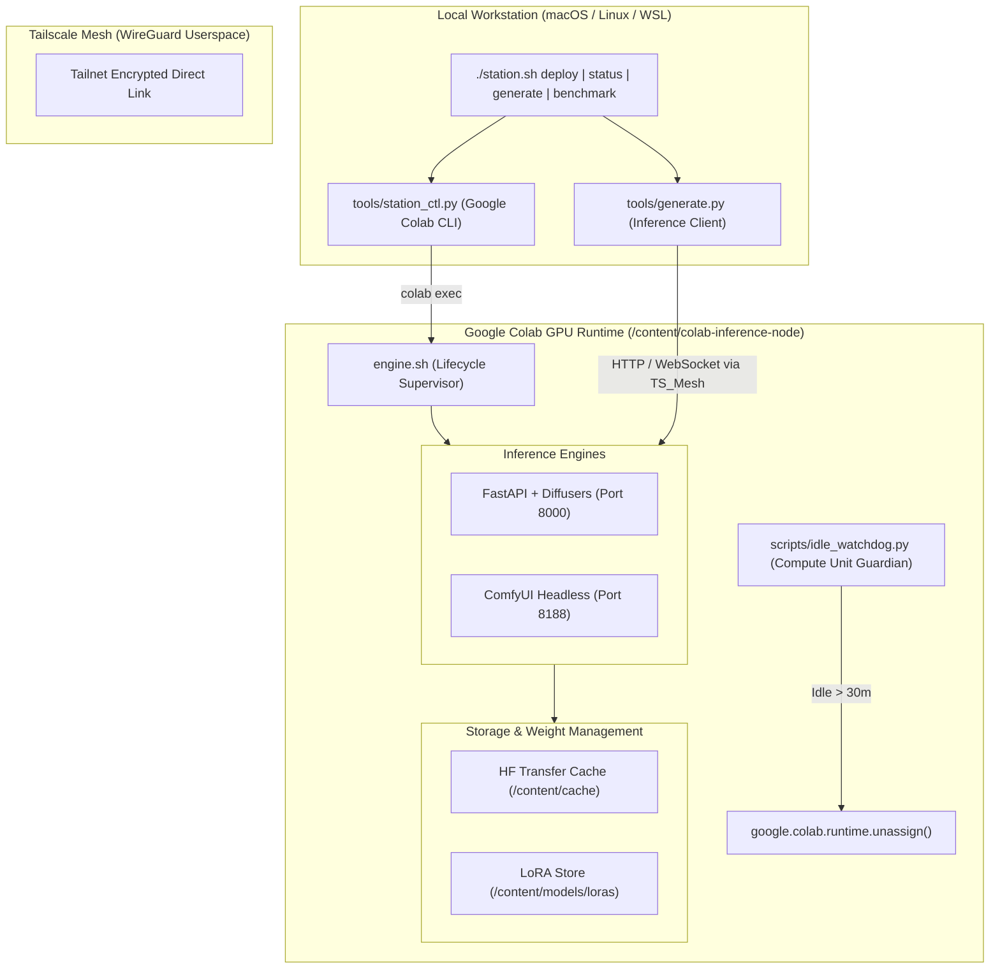

# Colab Model Station

An automated, reproducible remote inference and orchestration infrastructure for Google Colab GPU runtimes.

Designed to serve arbitrary deep learning models—with primary focus on diffusion models including **FLUX.1 (schnell/dev)**, **FLUX.2**, and **Stable Diffusion XL (SDXL)**—with dynamic **LoRA** hot-swapping over encrypted **Tailscale Userspace Mesh** or ephemeral **Cloudflare Tunnels**.

---

## 1. System Architecture



---

## 2. Key Features

- **Arbitrary Model Serving**: Modular engine architecture supporting both Hugging Face Diffusers pipelines and ComfyUI headless node graphs.
- **FLUX.1 & LoRA Hot-Swapping**: Native dynamic adapter loading, weight scaling, and unloading without reallocating base transformer pipelines.
- **Hardware-Aware Memory Optimization**: Automatic FP8 quantization and CPU offload strategy selection based on detected GPU VRAM (Tesla T4, NVIDIA L4, NVIDIA A100).
- **Accelerated Caching**: Native `hf_transfer` integration for high-speed weights prefetching; transparent Google Drive persistent caching when mounted.
- **Zero-Browser Headless CLI**: Automated remote provisioning, status checks, and teardown from local workstations using `google-colab-cli`.
- **Compute Unit Protection**: Integrated background watchdog automatically terminates Colab instances when idle, preventing credit drain.

---

## 3. Hardware & Quantization Matrix

| GPU Hardware | VRAM | Recommended Engine | Target Model | Precision | Offloading Strategy | Estimated Latency |
| :--- | :--- | :--- | :--- | :--- | :--- | :--- |
| **NVIDIA T4** | 15 GB | **Diffusers** | `black-forest-labs/FLUX.1-schnell` | FP8 | Sequential Offload | ~35s - 50s (4 steps) |
| **NVIDIA T4** | 15 GB | **Diffusers** | `stabilityai/stable-diffusion-xl-base-1.0` | FP16 | Model Offload | ~12s - 18s (30 steps) |
| **NVIDIA L4** | 24 GB | **Diffusers** | `black-forest-labs/FLUX.1-schnell` | FP8 | Model Offload | ~12s - 18s (4 steps) |
| **NVIDIA L4** | 24 GB | **Diffusers** | `black-forest-labs/FLUX.1-dev` | FP8 | Model Offload | ~45s - 65s (28 steps) |
| **NVIDIA A100** | 40 / 80 GB | **Diffusers** | `black-forest-labs/FLUX.1-schnell` | BF16 | None (Full VRAM) | ~4s - 8s (4 steps) |
| **NVIDIA A100** | 40 / 80 GB | **Diffusers** | `black-forest-labs/FLUX.1-dev` | BF16 | None (Full VRAM) | ~15s - 25s (28 steps) |

---

## 4. Local Workstation Setup & Orchestration

### Prerequisites
1. Install `google-colab-cli`:
   ```bash
   pip install google-colab-cli
   # Authenticate with Google
   colab --auth=oauth2 usage
   ```
2. Configure local environment variables in `.env`:
   ```bash
   cp .env.example .env
   # Edit .env and supply your TAILSCALE_AUTHKEY
   ```

### Commands
```bash
# Deploy remote engine to Colab VM headlessly
./station.sh deploy --engine diffusers --model black-forest-labs/FLUX.1-schnell --precision fp8

# Inspect remote status and GPU utilization
./station.sh status

# Generate an image over Tailscale mesh
./station.sh generate --prompt "A futuristic model station on an alien planet" --output test.png

# Attach and scale a dynamic LoRA
./station.sh generate --prompt "Portrait in cyberpunk style" --lora "XLabs-AI/flux-RealismLora" --lora-weight 0.85

# Execute performance and throughput benchmark
./station.sh benchmark --steps 4 --iterations 3

# Stop Colab VM and release compute units
./station.sh stop
```

---

## 5. Colab Master CLI Operations (`engine.sh`)

When working directly inside Google Colab:

```bash
# 1. Environment bootstrap
bash engine.sh setup all

# 2. Start Diffusers server daemon (Port 8000)
bash engine.sh diffusers start --model "black-forest-labs/FLUX.1-schnell" --precision fp8
bash engine.sh diffusers status
bash engine.sh diffusers logs -f

# 3. Tailscale Userspace mesh networking
bash engine.sh tunnel tailscale up "$TAILSCALE_AUTHKEY"
bash engine.sh tunnel tailscale serve 8000

# 4. Optional Cloudflare public tunnel
bash engine.sh tunnel cloudflare up 8000

# 5. Start Idle Watchdog (30 minute timeout)
bash engine.sh watchdog start --timeout 1800

# 6. Full system teardown & runtime unassignment
bash engine.sh teardown
```

---

## 6. API Reference (Diffusers Engine)

### `GET /health`
Returns runtime status, GPU device properties, VRAM allocation, and idle seconds.

### `POST /v1/images/generations`
Generate images from text prompts.
```json
{
  "prompt": "Cinematic photography of a mountain lake at dawn",
  "num_inference_steps": 4,
  "guidance_scale": 0.0,
  "width": 1024,
  "height": 1024,
  "seed": 42,
  "loras": [
    {
      "adapter_name": "realism",
      "weight": 0.85
    }
  ],
  "return_base64": true
}
```

### `POST /v1/loras/load`
Dynamically attach a LoRA adapter.
```json
{
  "lora_id_or_path": "XLabs-AI/flux-RealismLora",
  "adapter_name": "realism",
  "weight": 0.85
}
```

### `POST /v1/loras/unload`
Detach a LoRA adapter and release CUDA memory.
```json
{
  "adapter_name": "realism"
}
```

### `POST /v1/system/teardown`
Gracefully shutdown engine and invoke `google.colab.runtime.unassign()`.
