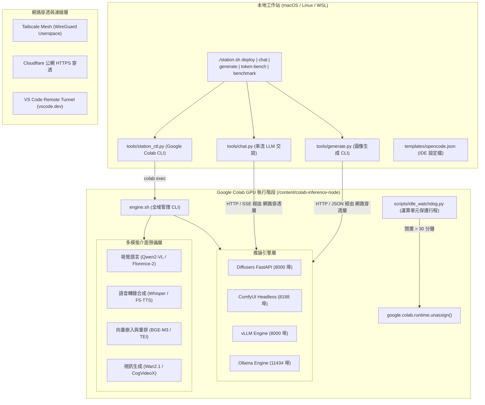

# Colab Model Station（模型工作站）

專為 Google Colab 與雲端 GPU 環境打造的自動化、可重現遠端推論與編排基礎設施。

支援跨領域的任意深度學習模型服務：
- **影像生成與擴散模型（Diffusion）**：**FLUX.1 (schnell/dev)**、**SDXL**、動態 **LoRA** 即時熱插拔與 **ComfyUI** 節點圖。
- **大型語言模型（LLM）**：**vLLM**（具備 PagedAttention 與 AWQ，提供 OpenAI 相容 API）與 **Ollama**（輕量化 GGUF 格式）。
- **多模態前瞻介面擴充**：具備 **視覺語言模型（VLM）**、**語音 AI（Audio ASR/TTS）**、**向量嵌入（Embedding）** 與 **視訊生成（Video Diffusion）** 的標準抽象介面。
- **三重穿透網路支援**：**Tailscale Userspace Mesh 私網直連**、**Cloudflare 公網穿透通道** 與 **VS Code Remote Tunnel 遠端開發**。

---

## 1. 系統架構圖



---

## 2. 核心特色

- **多引擎一體化管理**：透過單一入口腳本 [`engine.sh`](file:///content/colab-inference-node/engine.sh) 統一管控 vLLM、Ollama、Diffusers 與 ComfyUI。
- **FLUX.1 與動態 LoRA 熱插拔**：原生支援即時動態掛載、權重縮放與卸載 LoRA 配接器，無需重新載入基底模型。
- **硬體感知顯存最佳化**：根據獲配的 GPU 顯存（Tesla T4、NVIDIA L4、NVIDIA A100）自動配置 FP8 量化與 CPU 卸載策略。
- **高速權重快取**：整合 `hf_transfer` 實現數百 MB/s 高速預先下載；掛載 Google Drive 時自動啟用永久性權重快取。
- **VS Code Remote Tunnel 整合**：支援原生桌面版 VS Code 與網頁版 `vscode.dev` 直連開發，並自動保存憑證至 Google Drive。
- **運算單元保護機制**：內建背景閒置監控守護行程，超時自動執行 `unassign()` 終止虛擬機，嚴防運算點數耗盡。

---

## 3. 硬體規格與推薦模型配置矩陣

| GPU 硬體 | 顯存 (VRAM) | 推薦推論引擎 | 目標模型 | 精度 / 格式 | 記憶體卸載策略 | 適用工作負載 |
| :--- | :--- | :--- | :--- | :--- | :--- | :--- |
| **NVIDIA T4** | 15 GB | **Ollama** | `qwen2.5-coder:7b` | GGUF Q4_K_M | 全顯存常駐 | 輕量化代碼輔助與日常交談 |
| **NVIDIA T4** | 15 GB | **Diffusers** | `black-forest-labs/FLUX.1-schnell` | FP8 | 序列循序卸載 (Sequential) | 4 步高速擴散生成 |
| **NVIDIA T4** | 15 GB | **Diffusers** | `stabilityai/stable-diffusion-xl-base-1.0` | FP16 | 模型卸載 (Model Offload) | SDXL 潛在擴散生成 |
| **NVIDIA L4** | 24 GB | **Ollama** | `qwen2.5-coder:32b` | GGUF Q4_K_M | 全顯存常駐 | 高階 IDE 程式開發 |
| **NVIDIA L4** | 24 GB | **vLLM** | `Qwen/Qwen2.5-Coder-14B-Instruct-AWQ` | 4-bit AWQ | 全顯存常駐 | 高並發批次伺服服務 |
| **NVIDIA L4** | 24 GB | **Diffusers** | `black-forest-labs/FLUX.1-schnell` | FP8 | 模型卸載 (Model Offload) | 高速 FLUX 生成 (~15秒) |
| **NVIDIA A100** | 40 / 80 GB | **vLLM** | `deepseek-ai/DeepSeek-R1-Distill-Qwen-32B` | bfloat16 | 全顯存常駐 | 未量化旗艦推理模型服務 |
| **NVIDIA A100** | 40 / 80 GB | **Diffusers** | `black-forest-labs/FLUX.1-schnell` | BF16 | 全顯存常駐 | 原生全精度 FLUX (~5秒) |

---

## 4. 本地工作站配置與編排指南

### 前置需求
1. 安裝 `google-colab-cli`：
   ```bash
   pip install google-colab-cli
   colab --auth=oauth2 usage
   ```
2. 設定本地環境變數檔案 `.env`：
   ```bash
   cp .env.example .env
   # 於 .env 填入你的 TAILSCALE_AUTHKEY
   ```

### 常用指令
```bash
# 遠端無介面自動部署推論引擎 (擴散模型或語言模型)
./station.sh deploy --engine diffusers --model black-forest-labs/FLUX.1-schnell --precision fp8
# 或部署語言模型：
./station.sh deploy --engine vllm --model Qwen/Qwen2.5-Coder-7B-Instruct-AWQ

# 查詢遠端節點運作狀態
./station.sh status

# 互動式 LLM 串流交談
./station.sh chat --endpoint http://colab-model-station:8000 --model Qwen/Qwen2.5-Coder-7B-Instruct-AWQ

# 遠端影像生成產圖
./station.sh generate --prompt "A futuristic model station on an alien planet" --output test.png

# 基準效能評測
./station.sh token-bench --endpoint http://colab-model-station:8000
./station.sh benchmark --steps 4 --iterations 3

# 終止 Colab 虛擬機並停止計費
./station.sh stop
```

---

## 5. Colab 內部生命週期管理 (`engine.sh`)

若直接在 Google Colab 終端機內操作：

```bash
# 1. 依據需求安裝依賴套件
bash engine.sh setup [diffusers|ollama|vllm|comfyui|tunnels|all]

# 2. 擴散模型引擎管理
bash engine.sh diffusers start --model "black-forest-labs/FLUX.1-schnell" --precision fp8
bash engine.sh diffusers stop
bash engine.sh comfyui start
bash engine.sh comfyui stop

# 3. 語言模型引擎管理
bash engine.sh vllm start --model "Qwen/Qwen2.5-Coder-7B-Instruct-AWQ"
bash engine.sh vllm stop
bash engine.sh ollama start
bash engine.sh ollama pull qwen2.5-coder:7b
bash engine.sh ollama stop

# 4. 穿透網路與遠端 IDE 連線
bash engine.sh tunnel tailscale up "$TAILSCALE_AUTHKEY"
bash engine.sh tunnel tailscale serve 8000
bash engine.sh tunnel cloudflare up 8000
bash engine.sh tunnel vscode start "colab-model-station"

# 5. 閒置保護守護行程與終止
bash engine.sh watchdog start --timeout 1800
bash engine.sh status
bash engine.sh teardown
```
