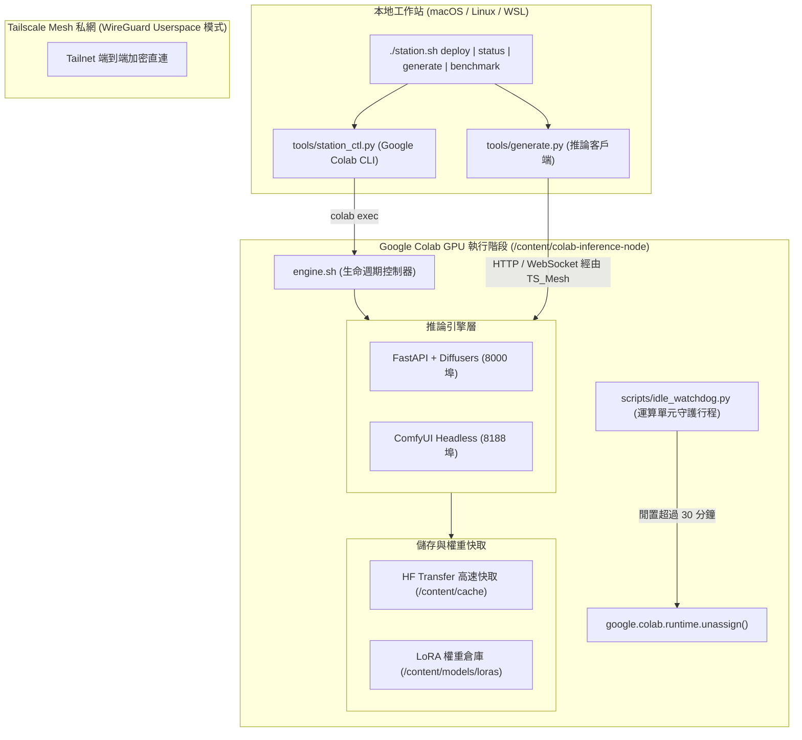

# Colab Model Station（模型工作站）

專為 Google Colab 與雲端 GPU 環境打造的自動化、可重現遠端推論與編排基礎設施。

旨在支援任意深度學習模型—核心聚焦於擴散模型，包含 **FLUX.1 (schnell/dev)**、**FLUX.2** 與 **Stable Diffusion XL (SDXL)**—並具備透過加密的 **Tailscale Userspace Mesh** 或暫時性 **Cloudflare Tunnels** 進行動態 **LoRA** 熱插拔切換的能力。

---

## 1. 系統架構圖



---

## 2. 核心特色

- **任意模型推論**：模組化雙引擎設計，同時支援 Hugging Face Diffusers 管線與 ComfyUI 無前端 API 節點圖模式。
- **FLUX.1 與動態 LoRA 熱插拔**：原生支援即時動態掛載、權重縮放與卸載 LoRA 配接器，無需重新載入數十 GB 的 Transformer 基底管線。
- **硬體感知顯存最佳化**：根據獲配的 GPU 顯存（Tesla T4、NVIDIA L4、NVIDIA A100）自動配置 FP8 量化與 CPU 卸載模式（Sequential / Model Offload）。
- **高速權重快取**：整合 `hf_transfer` 實現數百 MB/s 高速下載；掛載 Google Drive 時自動啟用永久性權重快取。
- **無介面命令列編排**：本機工作站透過 `google-colab-cli` 實現全自動遠端發布、健康檢查與終止，完全無需手動開啟瀏覽器操作。
- **運算單元保護機制**：內建背景閒置監控守護行程，超時自動執行 `unassign()` 終止虛擬機，嚴防運算點數耗盡。

---

## 3. 硬體規格與量化配置矩陣

| GPU 硬體 | 顯存 (VRAM) | 推薦推論引擎 | 目標模型 | 精度格式 | 記憶體卸載策略 | 預估推論耗時 |
| :--- | :--- | :--- | :--- | :--- | :--- | :--- |
| **NVIDIA T4** | 15 GB | **Diffusers** | `black-forest-labs/FLUX.1-schnell` | FP8 | 序列卸載 (Sequential) | ~35秒 - 50秒 (4 步) |
| **NVIDIA T4** | 15 GB | **Diffusers** | `stabilityai/stable-diffusion-xl-base-1.0` | FP16 | 模型卸載 (Model Offload) | ~12秒 - 18秒 (30 步) |
| **NVIDIA L4** | 24 GB | **Diffusers** | `black-forest-labs/FLUX.1-schnell` | FP8 | 模型卸載 (Model Offload) | ~12秒 - 18秒 (4 步) |
| **NVIDIA L4** | 24 GB | **Diffusers** | `black-forest-labs/FLUX.1-dev` | FP8 | 模型卸載 (Model Offload) | ~45秒 - 65秒 (28 步) |
| **NVIDIA A100** | 40 / 80 GB | **Diffusers** | `black-forest-labs/FLUX.1-schnell` | BF16 | 全顯存常駐 (None) | ~4秒 - 8秒 (4 步) |
| **NVIDIA A100** | 40 / 80 GB | **Diffusers** | `black-forest-labs/FLUX.1-dev` | BF16 | 全顯存常駐 (None) | ~15秒 - 25秒 (28 步) |

---

## 4. 本地工作站配置與編排指南

### 前置需求
1. 安裝 `google-colab-cli`：
   ```bash
   pip install google-colab-cli
   # 進行 Google 帳號授權
   colab --auth=oauth2 usage
   ```
2. 設定本地環境變數檔案 `.env`：
   ```bash
   cp .env.example .env
   # 編輯 .env 並填入你的 TAILSCALE_AUTHKEY
   ```

### 常用指令
```bash
# 遠端無介面自動部署至 Colab 虛擬機
./station.sh deploy --engine diffusers --model black-forest-labs/FLUX.1-schnell --precision fp8

# 查詢遠端虛擬機與推論引擎運作狀態
./station.sh status

# 透過 Tailscale 私網發送產圖請求並儲存至本地
./station.sh generate --prompt "A futuristic model station on an alien planet" --output test.png

# 動態掛載並指定 LoRA 權重
./station.sh generate --prompt "Portrait in cyberpunk style" --lora "XLabs-AI/flux-RealismLora" --lora-weight 0.85

# 執行效能與吞吐量基準測試
./station.sh benchmark --steps 4 --iterations 3

# 終止 Colab 虛擬機並停止計費
./station.sh stop
```

---

## 5. Colab 內部生命週期管理 (`engine.sh`)

若直接在 Google Colab 終端機內操作：

```bash
# 1. 環境依賴快速安裝
bash engine.sh setup all

# 2. 啟動 Diffusers 伺服器行程 (8000 埠)
bash engine.sh diffusers start --model "black-forest-labs/FLUX.1-schnell" --precision fp8
bash engine.sh diffusers status
bash engine.sh diffusers logs -f

# 3. 連線至 Tailscale Userspace 網狀私網
bash engine.sh tunnel tailscale up "$TAILSCALE_AUTHKEY"
bash engine.sh tunnel tailscale serve 8000

# 4. (選用) 建立 Cloudflare 公網穿透通道
bash engine.sh tunnel cloudflare up 8000

# 5. 啟動閒置守護行程 (設定 30 分鐘逾時)
bash engine.sh watchdog start --timeout 1800

# 6. 完整資源釋放與 Colab 執行階段中斷
bash engine.sh teardown
```
